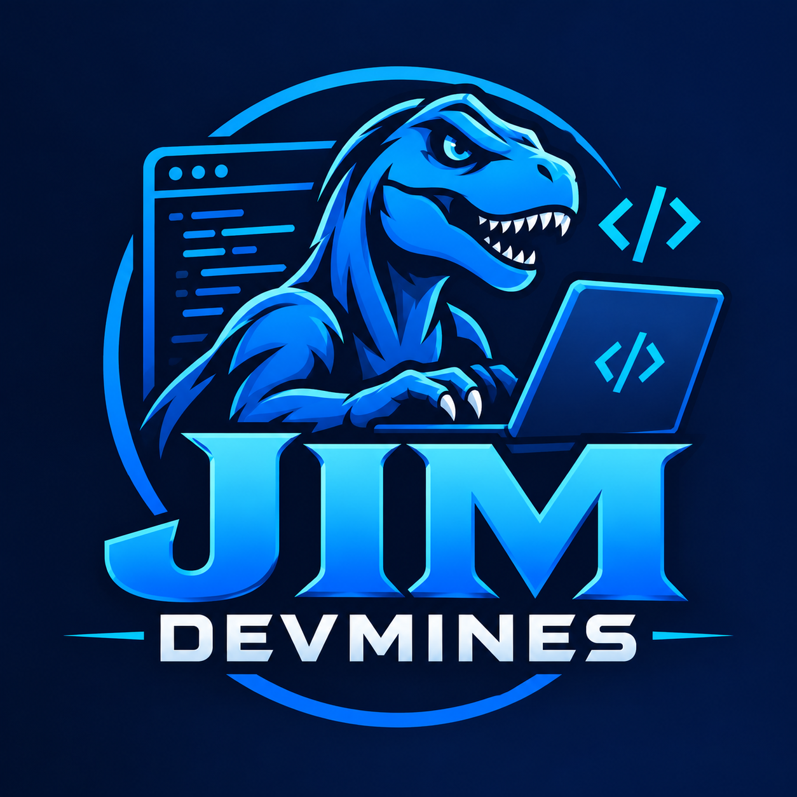

<!DOCTYPE html>
<html lang="en">
<head>
    <meta charset="UTF-8">
    <meta name="viewport" content="width=device-width, initial-scale=1.0">
    <title>Document</title>
    <link href="https://cdn.jsdelivr.net/npm/bootstrap@5.3.0/dist/css/bootstrap.min.css" rel="stylesheet" integrity="sha384-9ndCyUaIbzAi2FUVXJi0CjmCapSmO7SnpJef0486qhLnuZ2cdeRhO02iuK6FUUVM" crossorigin="anonymous">
    <link rel="stylesheet" href="style.css">
</head>
<body>

    <!-- navigation bar --> 
    <header class="p-2 text-bg-dark fixed-top" role="navigation">
        
            
 
                  
                    <ul class="nav col-auto col-lg-auto me-lg-auto mb-2 justify-content-center mb-md-0"> 
                        <li><a href="#index.html" class="nav-link px-2 text-secondary">Home</a></li> 
                        <li><a href="#about.html" class="nav-link px-2 text-white">About</a></li> 
                        <li><a href="#features.html" class="nav-link px-2 text-white">Features</a></li> 
                        <li><a href="#contact.html" class="nav-link px-2 text-white">Contact</a></li>
                    </ul>
            
 
       
    </header>

                <!-- hero section --> 
    <main class="p-5 text-center" id="index.html"> 
        
 
            JIM
            
 
                

                    I am a web developer, passionate about creating responsive and user-friendly websites..
                    I want to develop more websites.
                
 
                
 
                    <button type="button" class="btn btn-primary btn-lg px-4 me-sm-3">My Projects</button> 
                    <button type="button" class="btn btn-outline-secondary btn-lg px-4">Get A Quote</button> 
                
 
            
 
            
 
                
 
                     
                
 
            
 
        

    </main>

    <about class="p-5 text-center" id="about.html"> 
        
 
            <h1 class="display-4 fw-bold">About Me</h1> 
            
 
                
I am a web developer with a passion for creating responsive and user-friendly websites. I have experience in HTML, CSS, JavaScript, and various web development frameworks. My goal is to deliver high-quality web solutions that meet the needs of clients and users.
 
            
 
        

    </about>
    <section class="p-5 text-center" id="features.html"> 
        
 
            <h1 class="display-4 fw-bold">My Projects</h1> 
            
 
                
Here are some of the projects I have worked on. Each project showcases my skills in web development and design.
 
            
 
        

    </section>
    <section class="p-5 text-center" id="contact.html"> 
        
 
            <h1 class="display-4 fw-bold">Contact Me</h1> 
            
 
                
If you would like to get in touch with me for any inquiries or collaborations, please feel free to reach out through the contact form below.
 
            
 
        

        <footer class="py-1 my-1 text-bg-dark"> 
            <ul class="nav justify-content-center border-bottom pb-3 mb-3"> 
                 <li><a href="#index.html" class="nav-link px-2 text-secondary">Home</a></li> 
                        <li><a href="#about.html" class="nav-link px-2 text-white">About</a></li>
                        <li><a href="#features.html" class="nav-link px-2 text-white">Features</a></li>
                        <li><a href="#contact.html" class="nav-link px-2 text-white">Contact</a></li>
                </ul> 
                
© 2025 Company, Inc
 
            </footer>
</body>
</html>
